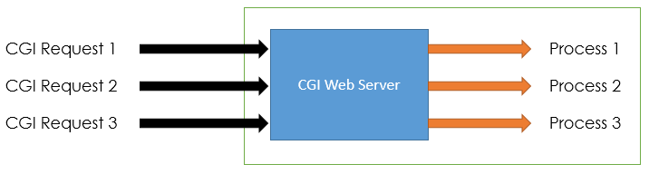
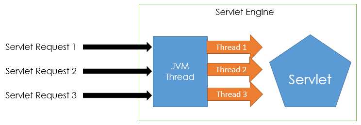
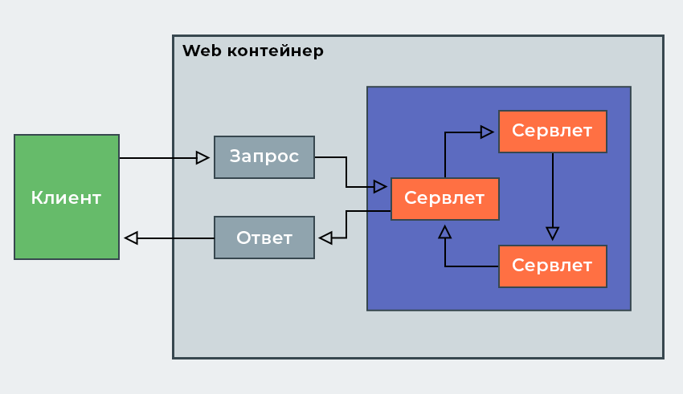

# Лабораторная работа №2

## 1. Java-сервлеты. Особенности реализации, ключевые методы, преимущества и недостатки относительно CGI и FastCGI

|Связанные вопросы|
| --- |
|[CGI](Lab1.md#12-%D1%81%D0%B5%D1%80%D0%B2%D0%B5%D1%80%D0%BD%D1%8B%D0%B5-%D1%81%D1%86%D0%B5%D0%BD%D0%B0%D1%80%D0%B8%D0%B8-cgi---%D0%BE%D0%BF%D1%80%D0%B5%D0%B4%D0%B5%D0%BB%D0%B5%D0%BD%D0%B8%D0%B5-%D0%BD%D0%B0%D0%B7%D0%BD%D0%B0%D1%87%D0%B5%D0%BD%D0%B8%D0%B5-%D0%BA%D0%BB%D1%8E%D1%87%D0%B5%D0%B2%D1%8B%D0%B5-%D0%BE%D1%81%D0%BE%D0%B1%D0%B5%D0%BD%D0%BD%D0%BE%D1%81%D1%82%D0%B8)|
|[CGI & FastCGI](Lab1.md#13-fastcgi-%D0%B8-cgi)|

<br>

### Ключевые отличия

Заранее определимся, что CGI (и FastCGI) и Java Servlet - это спецификации:
* [CGI 1.1 RFC3875](https://web.archive.org/web/20090529081353/http://www.ietf.org/rfc/rfc3875.txt)
* [Java Servlet 4.0 FINAL](https://javaee.github.io/servlet-spec/downloads/servlet-4.0/servlet-4_0_FINAL.pdf)

Проще говоря, это свод некоторых правил, чтобы разные разработчики могли придумывать **свои** программы, которые
смогут работать с другими. Согласитесь, если бы не было каких либо правил и все писали бы "по-своему", то разработка
приложений была бы усложнена.

Сервлеты и CGI имеют различия как в своих подоходах, так и в спецификациях.

Из курса программирования мы знаем, что программа написанная на языке Java компилируется в байт-код, которая
потом исполняется на JVM. А CGI - это программа написанная на нативном языке, например, С, C++, Perl и тд., которые
могут быть платформозависимыми, в отличие от Java

Далее, важным отличием является то, что в CGI при каждом запросе клиента создается отдельный процесс, когда в сервлете
запрос клиента может обрабатываться в JVM Thread

<p align="center">CGI<br></p>
<p align="center">Java Servlet<br></p>

Создание процессов негативно сказывается на CPU, так как их создание может нагрузить CPU. Разумеется, то же самое можно
сказать и про JVM Thread, но вторые более легковесны, чем отдельные процессы.

Помимо нагрузки на CPU мы можем получить некоторые преимущества. Например, исключение конфликтов при параллельной
обработке нескольких запросов или изолированность CGI-сценариев (падение CGI-сценария не приводит к падению всего сервера)

Собирая все выше сказанное, также можно утверждать что в среднем сценарии написанные на Java сервлетах исполняются быстрее,
по нескольким причинам:
1. В абсолютном большинстве случаев создание нового процесса дороже, чем создание нового потока
2. Потоки можно хранить в пуле потоков и использовать старые, а не создавать новые. Поэтому даже в том
случае, если создание процесса будет дешевым, то потоки можно оптимизровать и переиспользовать
3. Когда CGI-программа завершается, также теряются все состояния и при новом запросе его нужно будет восстановить
для нового процесса (в том числе конфигурация). А сервлеты могут сохранять важные состояния в памяти, которые повторно используются в запросах.

### Java Servlet
Как ранее говорилось, Java Servlet - это спецификация. То есть некоторые инструкции и правила, которых должны придерживаться
разработчики скриптов и программ их запускающих.

Можно отчетливо видеть влияние CGI на технологию сервлетов. Здесь также исполняются отдельные программы, которые принимают запросы
и выдают ответ

```java
import java.io.IOException;
import java.io.PrintWriter;
import javax.servlet.ServletException;
import javax.servlet.http.HttpServlet;
import javax.servlet.http.HttpServletRequest;
import javax.servlet.http.HttpServletResponse;
import javax.servlet.http.HttpSession;

public class ExampleServlet extends HttpServlet {

    @Override
    protected void doGet(HttpServletRequest request, HttpServletResponse response) throws ServletException, IOException {

        String parameter = request.getParameter("parameter");

        HttpSession session = request.getSession(true);
        session.setAttribute("parameter", parameter);

        response.setContentType("text/html;charset=UTF-8");
        PrintWriter out = response.getWriter();
        try {
            // не пишите так, пожалуйста!
            out.println("<html>");
            out.println("<head>");
            out.println("<title>Заголовок</title>");
            out.println("</head>");
            out.println("<body>");
            out.println("<h1>se.ifmo/" + parameter + "</h1>");
            out.println("</body>");
            out.println("</html>");
        } finally {
            out.close();
        }
    }

    @Override
    public String getServletInfo() {
        return "Пример сервлета)";
    }

}
```

Для соблюдения спецификации используются интерфейсы из пакета `javax.servlet`. Мы можем писать реализации
методов интерфейса соблюдая правила. В таком случае, мы можем быть уверены, что программа работающая с нашими сервлетами
запустит и будет использовать их правильно.

В зависимости от нужд мы можем реализовать методы:<br> `doGet`, `doPost`, `doPut`, `doDelete`, `getServletInfo`, `init` и `destroy` из [*HttpServlet*](https://docs.oracle.com/javaee/7/api/javax/servlet/http/HttpServlet.html)

Преимущества сервлетов над остальными технологиями (в сравнении не только с CGI):
- Быстрее работают чем CGI скрипты так как имеют разную модель процесса
- Используют стандартный API который поддерживается многими веб-серверами
- Имеют все преимущества платформы Java, включая простоту разработки и независимость платформы
- Имеют доступ ко множеству API, которые есть в Java платформе

## 2. Контейнеры сервлетов. Жизненный цикл сервлета

### Контейнер сервлетов
Как можно узнать из названия - это что-то, что хранит наши написаннные сервлеты. Но на самом деле, он делает гораздо больше, чем просто их хранение.

Контейнер сервлетов - это целый сервер, который занимается системной обработкой жизненного цикла сервлетов. Разумеется, все это делается в рамках спецификаций.

<p align=center>

</p>

Наиболее популярными контейнерами сервлетов являются :
- **Apache Tomcat**
- **JBoss**
- **GlassFish**
- Jetty
- IBM WebSphere
- Oracle Weblogic

Работа с ними довольно простая - вы создаете пакет с вашим приложением (обычно это либо `war`, либо `jar`) и конфигурируете уже стоящий на машине сервер, чтобы он также запустил и ваше приложение на каком-то порте.

Тем не менее, сейчас больше набирают популярность фреймворки, которые предоставляют такой сервер из под коробоки. То есть вам не нужно ставить отдельно Tomcat или GlassFish. Вот, например, использование GlassFish "из под коробки" [github/java-ee-grizzly-example](https://github.com/AppLoidx/jersey-grizzly-example)

<details>
    <summary><strong>Более детальное знакомство с контейнерами сервлетов</strong></summary>
  
  Контейнер сервлетов - это часть веб сервера или приложения, который предоставляет обслуживание сети (запросы, ответы), декодирует MIME-запросы и формирует MIME-ответы. Также хранит и управляет сервлетами весь их жизненный цикл.
  
  Все контейнеры сервлетов должны поддерживать протокол `HTTP` для запросов и ответов, но могут поддерживаться дополнительные протоколы, например, `HTTPS`.
  
  К поддерживаемым HTTP-протоколам относятся версии `HTTP/1.1` и `HTTP/2`.
  
  Также контейнер может накладывать ограничения безопасности на среду, в которой исполняется сервлет. В среде Java Platform, Standard Edition (J2SE, v.1.3 или выше) или Java Platform, Enterprise Edition (Java EE, v.1.3 или выше) эти ограничения должны устанавливаться в соответствии с архитектурой разрешений самой платформы Java. Например, некоторые сервера приложений могут накладывать ограничения на созднание `Thread` объекта, чтобы не было негативных последствий для других компонентов контейнера.
  
</details>

> Интересный факт: минимальная версия Java для работы с сервлетами Java SE 8

<br><br>

### Жизненный цикл сервлета

Сервлет проходит определенный жизненный цикл, который определяет как он загружается, инстанциируется, обрабатывает запросы  запросы клиентов и снимается с обслуживания.

Весь этот жизненный цикл выражен через методы `init`, `service` и `destroy` от интерфейса `javax.servlet.Servlet`, который должны имплементировать все сервлеты. Это можно сделать либо напрямую или косвенно через другие асбтрактные классы `GenericServlet` или `HttpServlet`.

**Загрузка и создание**

За загрузку и создание экземпляра сервлетов отвечает контейнер сервлетов описанный ранее. Этот процесс может происходить сразу после старта контейнера, либо позже, когда контейнер посчитает сервлет нужным для обработки запроса.

Когда механизм сервлета запускается, то контейнер находит классы сервлетов и загружает их, используя стандартные технологии загрузки Java. Загрузка может происходить из локальной файловой системы, удаленной системы или других сетевых ресурсов.

После загрузки класса сервлета - создается его экземпляр

**Инициализация**

После того как экземпляр сервлета создан - его необходимо инициализовать до того как он будет обрабатывать запросы клиентов. Контейнер инициализирует экземпляр сервлета, вызывая метод `init`, который предоставляется интерфейсом `Servlet` с уникальным (для каждого объявления сервлета) объектом интерфейса `ServletConfig`. Этот объект используется для получения доступа к параметрам конфигурации (`name`-`value`). Также через него можно поулчить доступ к контексту сервлета [`ServletContext`](Lab2.md#5-контекст-сервлета---назначение-способы-взаимодействия-сервлетов-с-контекстом)

**Обработка запросов**

После инициализации сервлет может использоваться контейнером для обработки запросов. Они представлены в виде `ServletRequest`, а для ответов передается тип `ServletResponse`

Для HTTP-запросов также предоставляются объекты `HttpServletRequest` и `HttpServletResponse`, которые расширяют предыдущий интерфейс.

> Интересный факт: экземпляр сервлета, помещенный в службу контейнером сервлета, может не обрабатывать запросы в течение своего жизненного цикла

**Конец**

На самом деле, контейнер сервлетов не обязан всегда держать сервлет загруженным. Сервлет может оставаться активным лишь в течение нескольких милисекунд.

Когда контейнер сервлета определяет, что сервлет должен быть удален из службы, он вызывает метод `destroy` интерфейса `Servlet`, чтобы позволит сервлету освободить любые ресурсы, которые он использует. Например, контейнер может сделать это, когда он хочет сохранить ресурсы памяти или при закрытии. Прежде чем контейнер сервлета вызовет метод `destroy`, он должен разрешить всем потокам, которые в данный момент выполняются в методе `service` сервлета, завершить выполнение или превысить определенный сервером промежуток времени.

После того как метод `destroy` был вызван для какого-то экземпляра, контейнер не будет пересылать туда запросы. Если сервлет понадобился контейнеру, то он должен создать новый экземпляр.

Далее, чтобы экземпляр удалился уборщиком мусора - контейнер отпускает (убирает ссылки) на экземпляр сервлета (уничтоженного)


<br><br><br>
<hr/>

**TODO LINE**


## 3. Диспетчеризация запросов в сервлетах. Фильтры сервлетов

## 4. HTTP-сессии - назначение, взаимодействие сервлетов с сессией, способы передачи идентификатора сессии

## 5. Контекст сервлета - назначение, способы взаимодействия сервлетов с контекстом

## 6. JavaServer Pages. Особенности, преимущества и недостатки по сравнению с сервлетами, область применения

## 7. Жизненный цикл JSP

## 8. Структура JSP-страницы. Комментарии, директивы, объявления, скриптлеты и выражения

## 9. Правила записи Java-кода внутри JSP. Стандартные переменные, доступные в скриптлетах и выражениях

## 10. Bean-компоненты и их использование в JSP

## 11. Стандартные теги JSP. Использование Expression Language (EL) в JSP

## 12. Параметры конфигурации JSP в дескрипторе развёртывания веб-приложения

## 13. Шаблоны проектирования и архитектурные шаблоны. Использование в веб-приложениях

## 14. Архитектура веб-приложений. Шаблон MVC. Архитектурные модели Model 1 и Model 2 и их реализация на платформе Java EE
