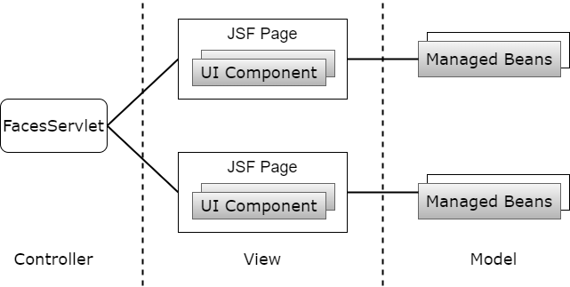
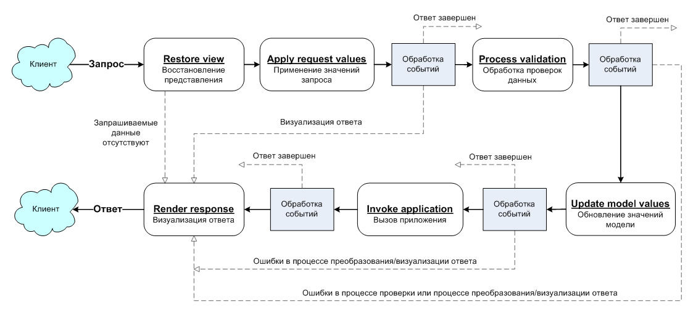

# Лабораторная работа №3

## 1. Технология *JavaServer Faces*. Особенности, отличия от сервлетов и JSP, преимущества и недостатки. Структура JSF-приложения
|Связанные вопросы|
| --- |
|[JSP](Lab2.md#6-javaserver-pages-%D0%BE%D1%81%D0%BE%D0%B1%D0%B5%D0%BD%D0%BD%D0%BE%D1%81%D1%82%D0%B8-%D0%BF%D1%80%D0%B5%D0%B8%D0%BC%D1%83%D1%89%D0%B5%D1%81%D1%82%D0%B2%D0%B0-%D0%B8-%D0%BD%D0%B5%D0%B4%D0%BE%D1%81%D1%82%D0%B0%D1%82%D0%BA%D0%B8-%D0%BF%D0%BE-%D1%81%D1%80%D0%B0%D0%B2%D0%BD%D0%B5%D0%BD%D0%B8%D1%8E-%D1%81-%D1%81%D0%B5%D1%80%D0%B2%D0%BB%D0%B5%D1%82%D0%B0%D0%BC%D0%B8-%D0%BE%D0%B1%D0%BB%D0%B0%D1%81%D1%82%D1%8C-%D0%BF%D1%80%D0%B8%D0%BC%D0%B5%D0%BD%D0%B5%D0%BD%D0%B8%D1%8F)|

### Технология *JavaServer Faces* (JSF) 
Это фреймворк для веб-приложений, для разработки пользовательских интерфейсов Java EE приложений. Основывается на использовании компонентов. Состояние компонентов пользовательского интерфейса сохраняется, когда пользователь запрашивает новую страницу и затем восстанавливается, если запрос повторяется.

### Преимущества JSF
- Четкое разделение бизнес-логики и интерфейса (фреймворк реализует шаблон *MVC*)

<p align="center">MVC-модель JSF<br></p>

- Управление обменом данными на уровне компонент
- Простая работа с событиями на стороне сервера
- Доступность нескольких реализаций от различных компаний-разработчиков
- Расширяемость (можно использовать дополнительные наборы компонентов)
- Широкая поддержка со стороны интегрированных средств разработки (*IDE*)

### Недостатки JSF
- Высокоуровневый фреймворк — сложно реализовывать не предусмотренную авторами функциональность
- Сложности с обработкой GET-запросов (устранены в JSF 2.0)
- Сложность разработки собственных компонентов.

### Структура JSF-приложения
- JSP-страницы с компонентами GUI
- Библиотека тегов
- Управляемые бины
- Доп. объекты(компоненты, конвертеры, валидаторы)
- Доп. теги
- Конфигурация – `faces-config.xml`
- Дескриптор развертывания – `web.xml`

## 2. Использование JSP-страниц и *Facelets*-шаблонов в JSF-приложениях
Интерфейс JSF-приложения состоит из страниц JSP (*Java Server Pages*), которые содержат компоненты, обеспечивающие функциональность интерфейса. При этом библиотеки тегов JSP используются на JSF-страницах для отрисовки компонентов интерфейса, регистрации обработчиков событий, связывания компонентов с валидаторами и конверторами данных и много другого.

При этом нельзя сказать, что JSF неразрывно связана с JSP, т.к. теги, используемые на JSP-страницах только отрисовывают компоненты, обращаясь к ним по имени. Жизненный же цикл компонентов JSF не ограничивается JSP-страницей.

### Пример страницы JSF (*Facelets*)
```html
<?xml version="1.0" encoding="UTF-8"?>
<!DOCTYPE html PUBLIC "-//W3C//DTD XHTML 1.0 Transitional//EN"
 "http://www.w3.org/TR/xhtml1/DTD/xhtml1-transitional.dtd">
<html xmlns="http://www.w3.org/1999/xhtml"
    xmlns:f="http://java.sun.com/jsf/core"
    xmlns:h="http://java.sun.com/jsf/html">
    <h:body>
        <h3>JSF 2.0 + Ajax Hello World Example</h3>
        <h:form>
            <h:inputText id="name" value="#{helloBean.name}" />
            <h:commandButton value="Welcome Me">
                <f:ajax execute="name" render="output" />
            </h:commandButton>
            <h2>
                <h:outputText id="output" value="#{helloBean.sayWelcome}" />
            </h2>
        </h:form>
    </h:body>
</html>
```

## 3. JSF-компоненты - особенности реализации, иерархия классов. Дополнительные библиотеки компонентов. Модель обработки событий в JSF-приложениях
### Особенности реализации JSF-компонент
- Интерфейс строится из компонентов
- Компоненты расположены на страницах JSP
- Компоненты реализуют интерфейс `javax.faces.component.UIComponent`
- Можно создавать собственные компоненты
- Компоненты на странице объединены в древовидную структуру — представление
- Корневым элементов представления является экземпляр класса `javax.faces.component.UIViewRoot`

### Некоторые компоненты JSF
- `<f:subview>`
- `<h:selectOneMenu>`
- `<h:selectOneRadio>`
- `<h:selectOneListbox>`
- `<h:selectManyCheckbox>`
- `<selectManyListbox>`
- `<selectManyMenu>`
- `<h:textArea>`, etc

### Пример использования компонентов
```html
<h:selectOneListbox id="type" value="#{contactController.contact.type}">
    <f:selectItem itemValue="PERSONAL" itemLabel="personal"/>
    <f:selectItem itemValue="BUSINESS" itemLabel="business"/>
</h:selectOneListbox>
```

### Фрагмент иерархии классов
```java
javax.faces.component.UIComponent
-- javax.faces.component.UIComponentBase
---- javax.faces.component.UIOutput
------ javax.faces.component.UIInput
-------- javax.faces.component.UISelectOne
-------- javax.faces.component.UISelectMany
```

### Дополнительные библиотеки компонентов
- *PrimeFaces*
- *RichFaces*
- *ICEFaces*
- *OpenFaces*
- *Trinidad*
- *Tomahawk*, etc

### Модель обработки событий
Жизненный цикл обработки запроса в приложениях JSF состоит из следующих фаз:

1. Восстановление представления

    Фаза формирования представления. JSF Runtime формирует представление по запросу (request) пользователя: создаются объекты компонентов, назначаются слушатели событий, конвертеры и валидаторы, все элементы представления помещаются в `FacesContext`

2. Использование параметров запроса (обработка событий)

    Фаза получения значений компонентов. Вызывается конвертер из стокового типа данных в требуемый тип. Если конвертация успешна, то значение сохраняется в локальной переменной компонента. Если неуспешно – создается сообщение об ошибке и помещается в `FacesContext`

3. Проверка данных (обработка событий)

    Фаза валидации значений компонентов. Вызываются валидаторы, зарегистрированные для компонентов представления. Если значение компонента не проходит валидацию, создается сообщение об ошибке и сохраняется в `FacesContext`

4. Обновление данных модели (обработка событий)

    Фаза обновления значений компонентов. Если данные валидны, то значение компонента обновляется. Новое значение присваивается полю объекта компонента

5. Вызов приложения (обработка событий)

    Фаза вызова приложения. Управление передается слушателям событий. Формируются новые значение компонентов

6. Вывод результата

    Фаза формирования ответа сервера. Обновляется представление в соответствии с результатом обработки запроса. Если это первый запрос к странице, то компоненты помещаются в иерархию представления. Формируется ответ сервера на запрос (response). На стороне клиента происходит обновление страницы.

<p align="center">Жизненный цикл JSF<br></p>

## 4. Конвертеры и валидаторы данных
### Конверторы
JSF имеет встроенные конверторы и позволяет создавать специализированные.

#### Стандартные конвертеры JSF
- `javax.faces.BigDecimal`
- `javax.faces.BigInteger`
- `javax.faces.Boolean`
- `javax.faces.Byte`
- `javax.faces.Character`
- `javax.faces.DateTime`
- `javax.faces.Double`
- `javax.faces.Float`

#### Пример использования
```html
<h:outputLabel value="Age" for="age" accesskey="age" />
<h:inputText id="age" size="3" value="#{contactController.contact.age}" />
<h:outputLabel value="Birth Date" for="birthDate" accesskey="b" />

<h:inputText id="birthDate" value="#{contactController.contact.birthDate}">
    <f:convertDateTime pattern="MM/yyyy" />
</h:inputText>
```

#### Специализированные конвертеры
1) Создать класс, реализующий интерфейс `Converter`
2) Реализовать метод `getAsObject()`, для преобразования строкового значения поля в объект
3) Реализовать метод `getAsString()`
4) Зарегистрировать конвертер в `FacesContext` в файле `faces-config.xml`, используя элемент `<converter>`

**Файл `faces-config.xml`**
```xml
<converter>
    <converter-for-class>
        com.arcmind.contact.model.Group
    </converter-for-class>
    <converter-class>
        com.arcmind.contact.converter.GroupConverter
    </converter-class>
</converter>
```

### Валидаторы
Существует 4 типа валидаторов

#### 1) С помощью встроенных компонентов
- `DoubleRangeValidator`
- `LongRangeValidator`
- `LengthValidator`

**Пример**
```html
<%-- возраст (age) --%>
<h:outputLabel value="Age" for="age" accesskey="age" />
<h:inputText id="age" size="3" value="#{contactController.contact.age}">
    <f:validateLongRange minimum="0" maximum="150"/>
</h:inputText>
<h:message for="age" errorClass="errorClass" />
```

#### 2) На уровне приложения
Это непосредственно бизнес-логика. Заключается в добавлении в методы управляемых bean-объектов кода, который использует модель приложения для проверки уже помещенных в нее данных.

#### 3) С помощью проверочных методов серверных объектов
Для типов данных, не поддерживаемых стандартными валидаторами, например, адресов электронной почты, можно создавать собственные валидирующие компоненты

#### 4) С помощью специализированных компонентов, реализующих интерфейс *Validator*
JSF позволяет создавать подключаемые валидирующие компоненты, которые можно использовать в различных Web-приложениях.
Это должен быть класс, реализующий интерфейс *Validator*, в котором реализован метод `validate()`. Необходимо зарегистрировать валидатор в файле `faces-config.xml`. После этого можно использовать тег `<f:validator/>` на страницах JSP.

**Файл `faces-config.xml`**
```xml
<validator>
    <validator-id>arcmind.zipCode</validator-id>
    <validator-class>com.arcmind.validators.ZipCodeValidator</validator-class>
</validator>
```

## 5. Представление страницы JSF на стороне сервера. Класс *UIViewRoot*
### Представление страницы JSF на стороне сервера
- *UI Component*. Объект с состоянием, методами, событиями, который содержится на сервере и отвечает за взаимодействие с пользователем (визуальный компонент). Каждый *UI Component* содержит метод метод `render()` для прорисовки самого себя, согласно правилам в классе *Render*

<p align="center">MVC-модель JSF<br></p>

- *Renderer*. Отвечает за отображение компонента и преобразование ввода пользователя

#### UIViewRoot
Объект *UIViewRoot* дает представление JSF, он связан с активным `FacesContext`. JSF реализация создает представление при первом обращении (запросе), либо восстанавливает уже созданное. Когда клиент отправляет форму (postback), JSF конвертирует отправленные данные, проверяет их, сохраняет в managed bean, находит представление для навигации, восстанавливает значения компонента из *managed bean*, генерирует ответ по представлению. Все эти действия JSF описываются с помощью 6 упорядоченных процессов. (см. [Жизненный цикл JSF](Lab3.md#%D0%BC%D0%BE%D0%B4%D0%B5%D0%BB%D1%8C-%D0%BE%D0%B1%D1%80%D0%B0%D0%B1%D0%BE%D1%82%D0%BA%D0%B8-%D1%81%D0%BE%D0%B1%D1%8B%D1%82%D0%B8%D0%B9))

## 6. Управляемые бины - назначение, способы конфигурации. Контекст управляемых бинов

## 7. Конфигурация JSF-приложений. Файл *faces-config.xml*. Класс *FacesServlet*

## 8. Навигация в JSF-приложениях

## 9. Доступ к БД из Java-приложений. Протокол JDBC, формирование запросов, работа с драйверами СУБД

## 10. Концепция ORM. Библиотеки ORM в приложениях на Java. Основные API. Интеграция ORM-провайдеров с драйверами JDBC

## 11. Библиотеки *ORM Hibernate* и *EclipseLink*. Особенности, API, сходства и отличия

## 12. Технология JPA. Особенности, API, интеграция с ORM-провайдерами
